<div align="center">

# 📖 BookForge

### Write it. Ingest it. Hear it. Ship it.

An AI-native authoring studio and reading environment. Generate a book from a single
prompt, or ingest a PDF or a URL and turn it into a chaptered, annotatable, narratable
work — then export it as a typeset PDF or DOCX.

<br/>


</div>

---

## 📑 Table of Contents

- [What BookForge Does](#-what-bookforge-does)
- [System Architecture](#-system-architecture)
- [Data Model](#-data-model)
- [API Reference](#-api-reference)
- [Key Flows](#-key-flows)
  - [Book Synthesis](#1-book-synthesis-prompt--finished-draft)
  - [Model Fallback Ladder](#2-the-model-fallback-ladder)
  - [PDF & URL Ingestion](#3-pdf--url-ingestion)
  - [The Reader](#4-the-reader-annotations-bookmarks-tts)
  - [Export Pipeline](#5-export-pipeline)
  - [Freemium Gating](#6-freemium-gating)
  - [Manga Hub](#7-manga-hub--social)
- [Getting Started](#-getting-started)
- [Environment Variables](#-environment-variables)
- [Project Structure](#-project-structure)
- [Scaling Playbook](#-scaling-playbook)
- [Roadmap](#-roadmap)

---

## ✨ What BookForge Does

BookForge is three products stacked into one app:

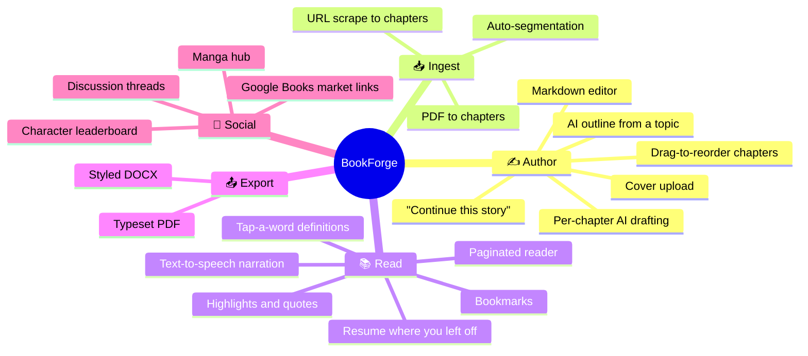

| Pillar | What you get |
| --- | --- |
| **Author** | Give a topic, style, and chapter count → Gemini returns a structured outline. Draft each chapter individually, edit in Markdown, reorder with drag-and-drop. |
| **Ingest** | Upload a text-readable PDF or paste a URL. BookForge extracts, chunks, and titles the segments into a working draft. |
| **Read** | A full reading surface: pagination, highlight/quote annotations with colors and notes, bookmarks, per-book resume position, inline word definitions, and audio narration. |
| **Export** | `pdfkit` for a typeset PDF; `docx` for a styled Word document with real heading levels, lists, and inline formatting parsed from Markdown. |
| **Social** | A manga hub with a one-vote-per-user character leaderboard, and discussion threads that attach to either a book or a manga. |

---

## 🏛 System Architecture

A classic decoupled two-tier deployment: a static SPA on the edge, a stateful API on a
container host, MongoDB Atlas behind it.

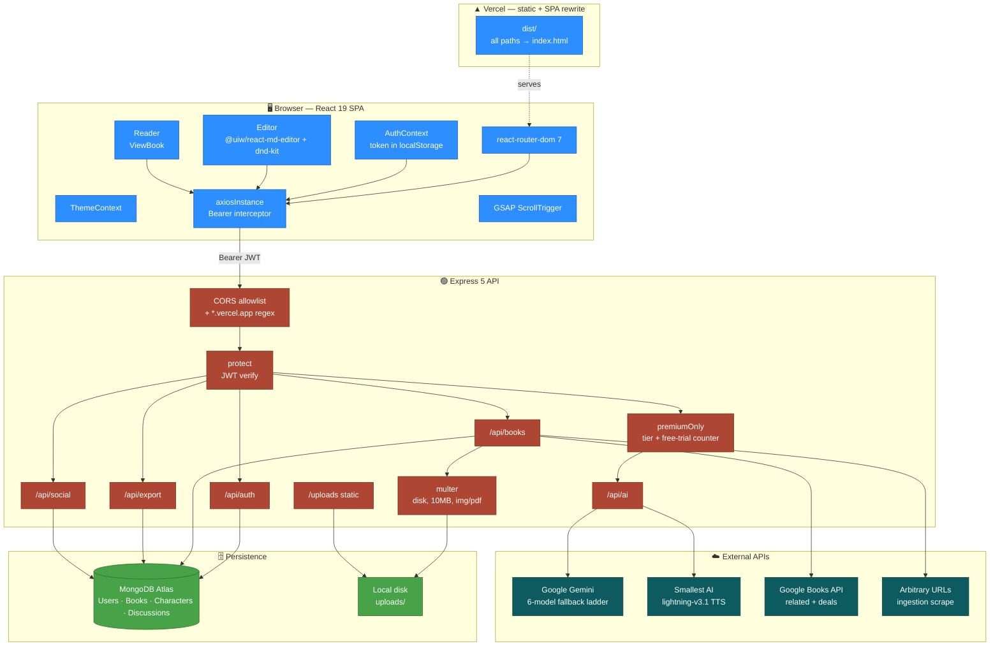

### Request lifecycle

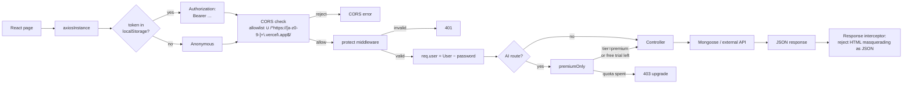

That last step is a real-world scar: a misconfigured `VITE_BASE_URL` in production makes the
SPA request itself, get `index.html` back with a `200 OK`, and fail deep inside a component.
The interceptor catches `content-type: text/html` and fails loudly instead.

---

## 🗄 Data Model

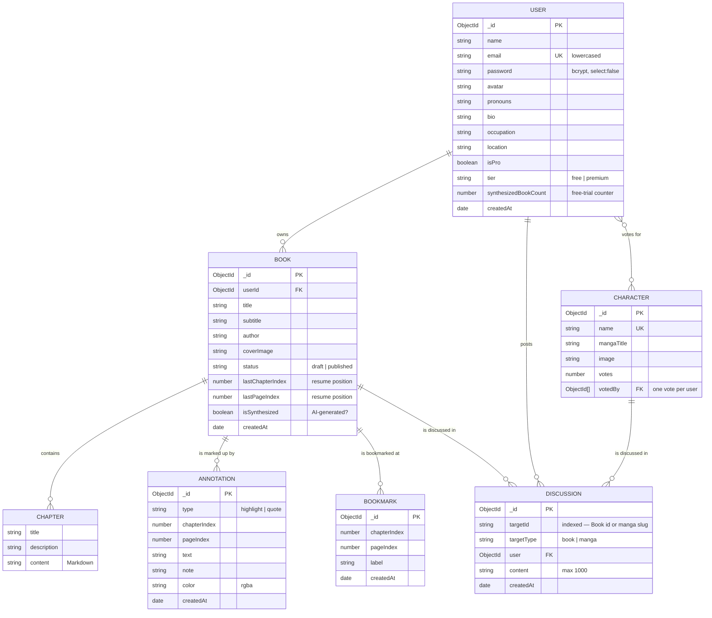

**Design note — everything is embedded.** Chapters, annotations, and bookmarks are
subdocuments on `Book`, not separate collections. One `findById` hydrates an entire reading
session: no joins, no `$lookup`, no N+1. The cost is a 16 MB BSON document ceiling and
whole-document rewrites on every save — see
[Scaling Playbook](#phase-1--fix-what-hurts-first) for when that flips from asset to liability.

**Design note — polymorphic discussions.** `Discussion.targetId` is a plain `String`, so the
same collection serves book threads (`ObjectId` as string) and manga threads (a slug).
`targetType` disambiguates, and `targetId` carries the index.

---

## 🔌 API Reference

Base: `http://localhost:5000` · All 🔒 routes need `Authorization: Bearer <jwt>`.

### `/api/auth`

| Method | Path | Auth | Description |
| --- | --- | :---: | --- |
| `POST` | `/register` | — | Create account, returns JWT |
| `POST` | `/login` | — | Returns JWT |
| `GET` | `/profile` | 🔒 | Current user |
| `PUT` | `/profile` | 🔒 | Update bio, pronouns, avatar, occupation, location |

### `/api/books`

| Method | Path | Auth | Description |
| --- | --- | :---: | --- |
| `POST` | `/` | 🔒 | Create a book |
| `GET` | `/` | 🔒 | List the caller's books |
| `GET` | `/:id` | 🔒 | Full book with chapters, annotations, bookmarks |
| `PUT` | `/:id` | 🔒 | Update metadata + chapters |
| `DELETE` | `/:id` | 🔒 | Delete |
| `PUT` | `/cover/:id` | 🔒 | Upload cover (`multipart`, field `coverImage`) |
| `POST` | `/upload-pdf` | 🔒 | PDF → chaptered draft (`multipart`, field `pdf`) |
| `POST` | `/ingest-url` | 🔒 | URL → chaptered draft |
| `PATCH` | `/progress/:id` | 🔒 | Save `lastChapterIndex` / `lastPageIndex` |
| `POST` | `/annotations/:id` | 🔒 | Add highlight or quote |
| `DELETE` | `/annotations/:id/:annotationId` | 🔒 | Remove annotation |
| `POST` | `/bookmarks/:id` | 🔒 | Add bookmark |
| `DELETE` | `/bookmarks/:id/:bookmarkId` | 🔒 | Remove bookmark |
| `GET` | `/related/:id` | 🔒 | Google Books lookups by title |
| `GET` | `/deals/:id` | 🔒 | Purchase links + prices, top 3 |

### `/api/ai` — all 🔒, outline & chapter also 💎 premium-gated

| Method | Path | Gate | Description |
| --- | --- | :---: | --- |
| `POST` | `/generate-outline` | 💎 | `{topic, style, numChapters, description}` → chapter array |
| `POST` | `/generate-chapter-content` | 💎 | Draft one chapter's prose |
| `POST` | `/define` | 🔒 | Definition for a tapped word, in context |
| `POST` | `/continue` | 🔒 | "Continue this story" from current text |
| `POST` | `/speak` | 🔒 | `{text, voiceId, voiceType}` → `audio/mpeg` |
| `POST` | `/get-chunks` | 🔒 | Split text into ~300-word chunks for streaming TTS |

### `/api/export` & `/api/social`

| Method | Path | Auth | Description |
| --- | --- | :---: | --- |
| `GET` | `/api/export/:id/pdf` | 🔒 | Typeset PDF via `pdfkit` |
| `GET` | `/api/export/:id/doc` | 🔒 | Styled DOCX via `docx` |
| `GET` | `/api/social/leaderboard` | — | Top 20 characters by votes |
| `POST` | `/api/social/vote/:id` | 🔒 | One vote per user, enforced by `votedBy` |
| `GET` | `/api/social/discuss/:targetId` | — | Thread for a book or manga |
| `POST` | `/api/social/discuss` | 🔒 | Post to a thread |

---

## 🔀 Key Flows

### 1. Book Synthesis: prompt → finished draft

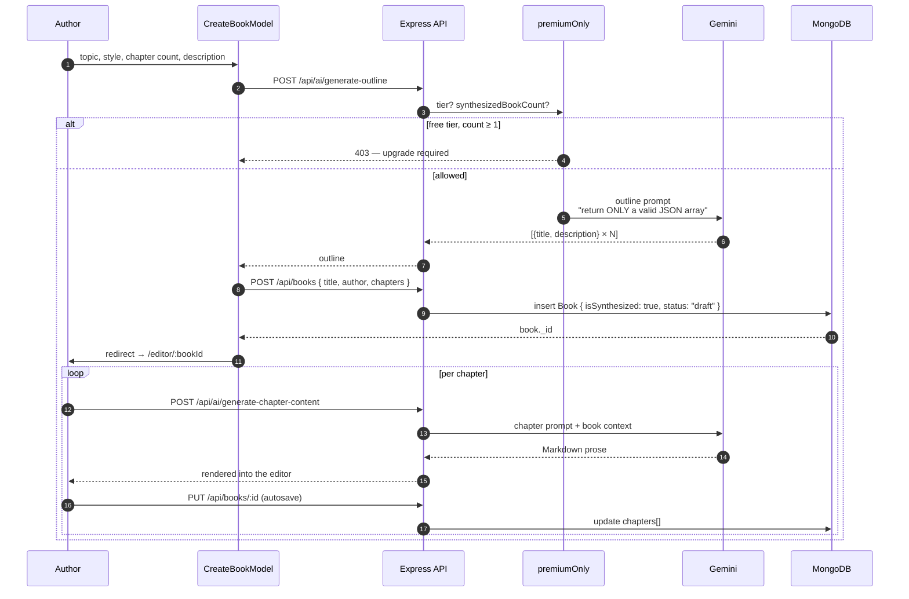

### 2. The Model Fallback Ladder

Gemini model availability varies by API key, region, and API version — a hard-coded model id
is a guaranteed future 404. `getRobustModel` walks a ladder until something answers, and if
everything 404s it introspects the account and logs what *is* available.

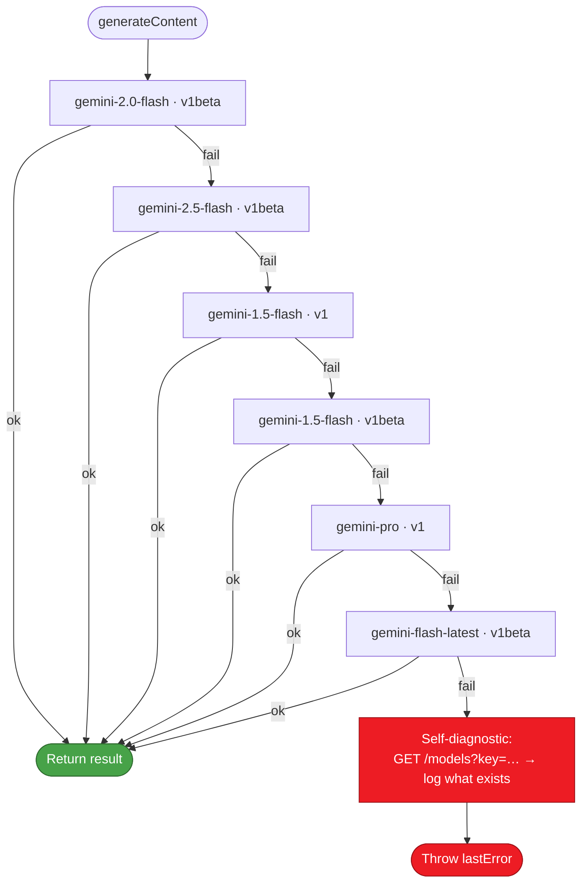

The same self-diagnostic runs once at server boot and prints every model the key can reach —
so a deployment that will fail at request time announces it in the startup log instead.

### 3. PDF & URL Ingestion

Two doors into the same destination: an unstructured blob becomes a chaptered `Book`.

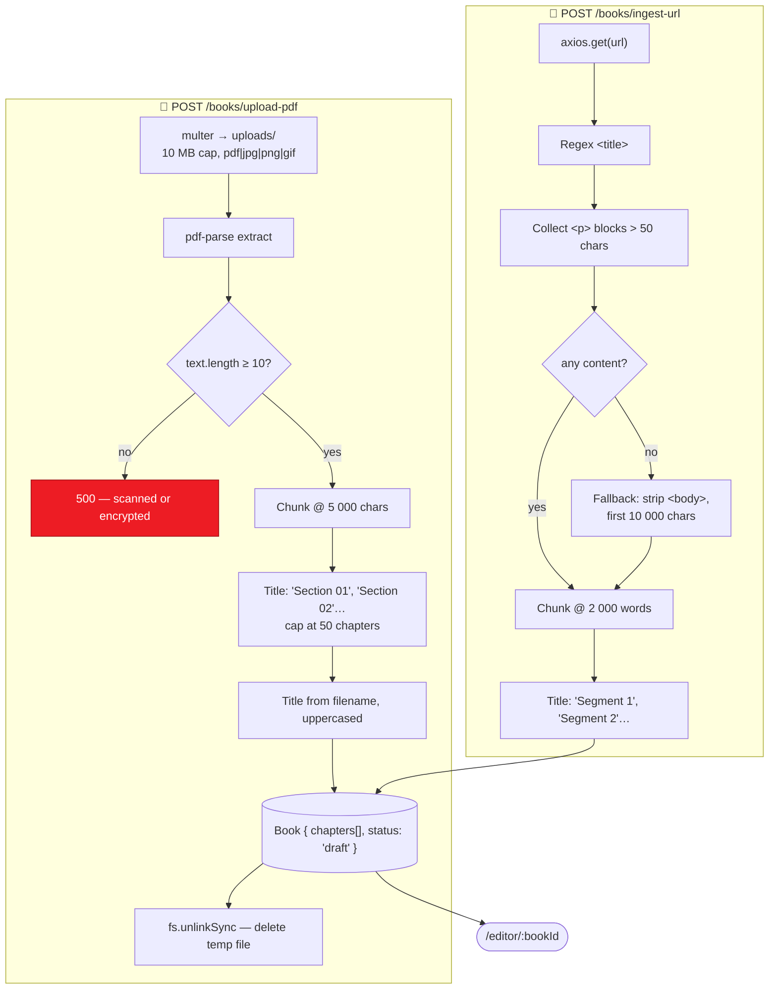

> ⚠️ `cheerio` is a declared dependency but the URL path currently runs on regex fallbacks —
> it was disabled to stop a crash and never re-enabled. Re-enabling it is a two-line change
> and materially improves extraction quality. See [Roadmap](#-roadmap).

### 4. The Reader: annotations, bookmarks, TTS

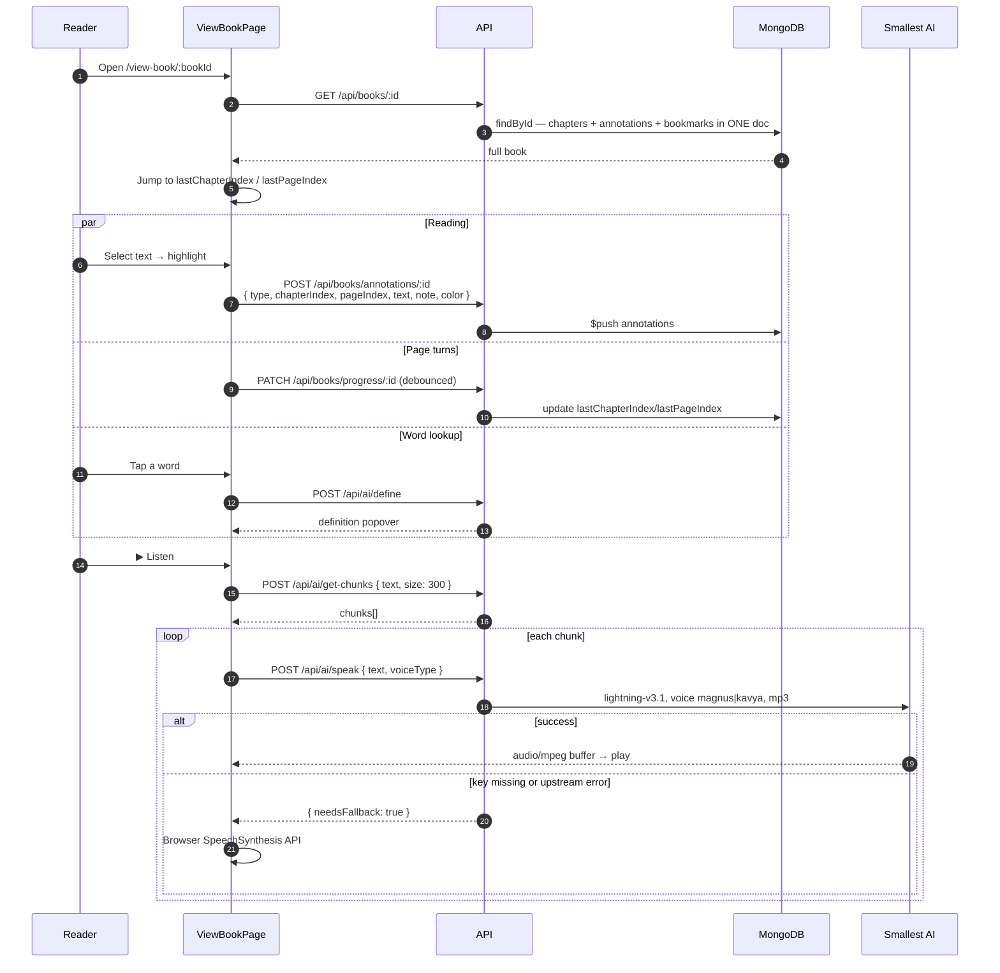

Chunking before synthesis is what makes narration feel instant: playback of chunk *n* starts
while chunk *n+1* is still being generated, and `needsFallback` means a missing API key
degrades to the browser's built-in voice rather than a broken button.

### 5. Export Pipeline

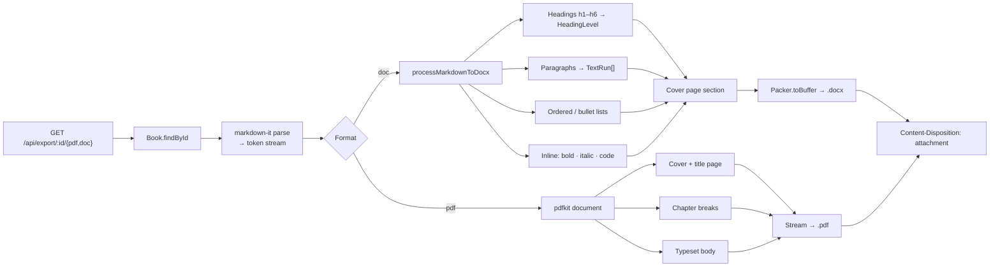

The DOCX path is a real Markdown→OOXML translator, not a `<p>`-dump: it walks
`markdown-it`'s token stream and emits proper `Paragraph` / `TextRun` / `HeadingLevel`
structures, so the exported file has a working navigation pane and real styles.

### 6. Freemium Gating

`premiumOnly` is deliberately generous — the free tier lets you finish one entire book, not
just start one.

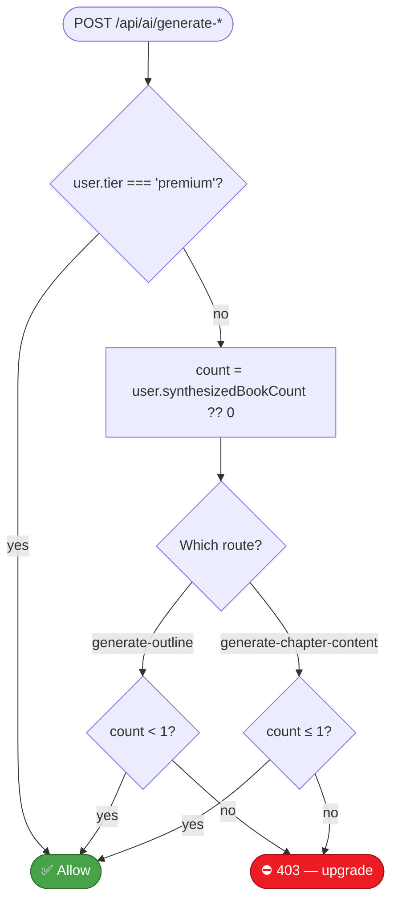

The asymmetry (`< 1` for outlines, `≤ 1` for chapters) is intentional: you get **one** free
outline, but you can keep drafting chapters for that book after the counter increments.

### 7. Manga Hub & Social

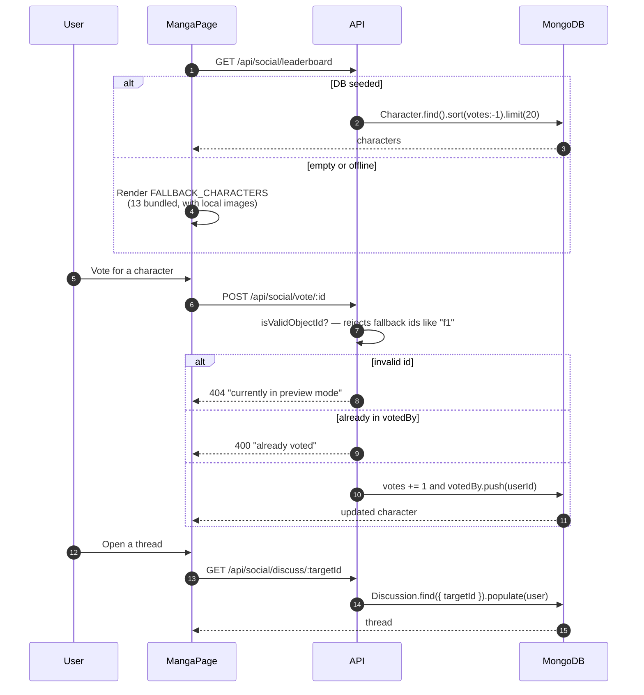

The fallback roster means the manga page is never blank — an unseeded database still renders
a full leaderboard, and the `ObjectId` guard stops the synthetic ids from causing Mongoose
cast errors when someone tries to vote.

---

## 🚀 Getting Started

### Prerequisites

- **Node.js 18+**
- **MongoDB** — Atlas or local
- A **Google Gemini** API key
- A **Smallest AI** API key (optional — TTS falls back to the browser)

### 1 · Backend

```bash
cd backend
npm install
cp .env.example .env        # fill in the values below
npm run dev                 # nodemon → http://localhost:5000
```

Watch the boot log — the startup diagnostic prints every Gemini model your key can reach:

```
--- STARTUP AI DIAGNOSTIC ---
Models identified: gemini-2.0-flash, gemini-1.5-flash, ...
-----------------------------
```

Seed the manga leaderboard (optional):

```bash
node seedCharacters.js
```

### 2 · Frontend

```bash
cd frontend/BookForge
npm install
cp .env.example .env        # VITE_BASE_URL=http://localhost:5000
npm run dev                 # → http://localhost:5173
```

### 3 · Verify

```bash
curl http://localhost:5000        # → "BookForge API is running 🚀"
```

### Deployment

| Piece | Host | Notes |
| --- | --- | --- |
| Frontend | **Vercel** | `vercel.json` rewrites every path to `/index.html` for client-side routing. Set `VITE_BASE_URL` to the API origin — **not** a `/api` suffix (the axios instance strips it, but be explicit). |
| Backend | Any Node host | Needs a persistent filesystem for `uploads/`, or swap to object storage first. |
| Database | MongoDB Atlas | |

CORS accepts the `CORS_ORIGINS` allowlist **plus** any `https://<name>.vercel.app`, so
preview deployments work without a config change.

### Backend diagnostic scripts

The repo ships a set of standalone probes, useful when a key or model misbehaves:

| Script | Purpose |
| --- | --- |
| `test-db.js` | MongoDB connectivity |
| `test-ai.js` · `verify-ai.js` | Gemini reachability |
| `check_models.js` · `discover_models.js` · `list-models.js` | Enumerate available models |
| `test-elevenlabs.js` · `check-api.js` | TTS provider probes |
| `final_diagnostic.js` | Full-stack smoke check |
| `seedCharacters.js` · `sync_characters.js` | Manga leaderboard data |
| `mock-server.js` | Frontend dev without the real backend |

---

## 🔑 Environment Variables

### `backend/.env`

| Variable | Required | Purpose |
| --- | :---: | --- |
| `MONGO_URI` | ✅ | MongoDB connection string |
| `JWT_SECRET` | ✅ | Signs and verifies auth tokens |
| `GEMINI_API_KEY` | ✅ | All AI generation |
| `PORT` | ⬜ | Defaults to `5000` |
| `CORS_ORIGINS` | ⬜ | Comma-separated allowlist; `*.vercel.app` always permitted |
| `SMALLEST_AI_API_KEY` | ⬜ | TTS narration — without it, `needsFallback` → browser voice |
| `ELEVEN_LABS_API_KEY` | ⬜ | Only used by the legacy diagnostic scripts |

> ⚠️ `.env.example` lists `ELEVENLABS_API_KEY`, but the code reads `ELEVEN_LABS_API_KEY`
> (with the underscore) — and the live TTS path uses `SMALLEST_AI_API_KEY`, which the example
> file omits entirely. Use the table above as the source of truth.

### `frontend/BookForge/.env`

| Variable | Required | Purpose |
| --- | :---: | --- |
| `VITE_BASE_URL` | ✅ in prod | API origin. Dev falls back to `http://localhost:8000`; production with this unset logs a loud deployment error. |
| `VITE_API_URL` | ⬜ | Legacy, kept for reference |

---

## 📁 Project Structure

```
BookForge/
├── backend/
│   ├── server.js                 # Express bootstrap, CORS, route mounting
│   ├── config/db.js              # Mongoose connection
│   ├── models/
│   │   ├── Book.js               # + embedded chapter/annotation/bookmark schemas
│   │   ├── User.js               # bcrypt pre-save hook, matchPassword method
│   │   ├── Character.js          # manga leaderboard
│   │   └── Discussion.js         # polymorphic threads
│   ├── controller/
│   │   ├── aiController.js       # getRobustModel ladder, outline, chapter, define,
│   │   │                         #   continue, speak, get-chunks
│   │   ├── bookController.js     # CRUD, PDF ingest, progress, annotations,
│   │   │                         #   bookmarks, related, deals
│   │   ├── ingestController.js   # URL → chapters
│   │   ├── exportController.js   # markdown-it → docx / pdfkit
│   │   ├── authController.js
│   │   └── socialController.js
│   ├── middlewares/
│   │   ├── authMiddleware.js     # protect + premiumOnly
│   │   └── uploadMiddleware.js   # multer, 10 MB, img|pdf
│   ├── routes/                   # auth · books · ai · export · social
│   ├── uploads/                  # ⚠️ ephemeral on most PaaS hosts
│   └── *.js                      # diagnostic scripts (see table above)
│
└── frontend/BookForge/
    ├── src/
    │   ├── App.jsx               # routes; /view-book renders outside the chrome
    │   ├── context/              # AuthContext · ThemeContext
    │   ├── utils/
    │   │   ├── axiosInstance.js  # Bearer interceptor + HTML-response guard
    │   │   └── apiPaths.js       # every endpoint, one place
    │   ├── pages/                # Landing · Login · Signup · Dashboard · Editor
    │   │                         # ViewBook · Profile · Pricing · Explore
    │   │                         # BookDetails · Manga · Discussion
    │   ├── components/
    │   │   ├── editor/           # BookDetailsTab · ChapterEditorTab
    │   │   │                     # ChapterSidebar · SimpleMDEditor
    │   │   ├── view/             # ViewBook · ViewChapterSidebar
    │   │   ├── models/           # CreateBookModel · PdfUploadModal
    │   │   ├── layout/ · landing/ · cards/ · dashboard/ · auth/ · ui/
    │   └── data/                 # mangaData, static content
    └── vercel.json               # SPA rewrite
```

---

## 📈 Scaling Playbook

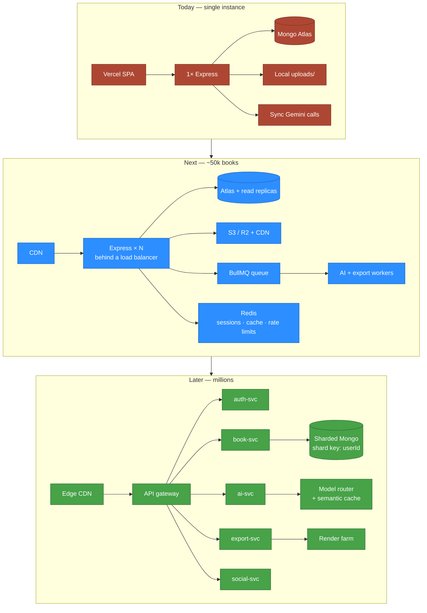

### Phase 1 — fix what hurts first

| # | Problem | Why it bites | Fix |
| --- | --- | --- | --- |
| 1 | **`uploads/` is on local disk** | Render/Railway/Heroku filesystems are ephemeral — every deploy silently deletes every cover image. Also blocks horizontal scaling: instance B can't serve a file instance A wrote. | Move covers to **S3 / Cloudinary / R2**. Store the URL, not the path. Highest-priority change in the repo. |
| 2 | **Books are one giant document** | `chapters`, `annotations`, and `bookmarks` all embed. A 50-chapter book with hundreds of highlights approaches Mongo's 16 MB ceiling, and *every* autosave rewrites the whole document. | Split `chapters` into its own collection keyed by `bookId` + `order`; keep annotations embedded (they're small and always read with the book). Add `PATCH /books/:id/chapters/:idx` so autosave writes one chapter, not the book. |
| 3 | **AI calls block the request** | Chapter generation can run 30–60 s. Each one pins a Node worker; a handful of concurrent authors saturates the event loop's practical concurrency. | Queue with **BullMQ + Redis**, return a job id, stream tokens over SSE. |
| 4 | **No rate limiting anywhere** | A single script can burn the entire Gemini quota. `premiumOnly` gates *entitlement*, not *rate*. | `express-rate-limit` + Redis store, tiered by `user.tier`. |
| 5 | **`GET /books` returns everything** | No pagination, no projection — the dashboard downloads full chapter text for every book to render cards. | `.select('title author coverImage status updatedAt')` + cursor pagination. |
| 6 | **`ingest-url` is an SSRF vector** | `axios.get(userSuppliedUrl)` from inside your network reaches `169.254.169.254`, `localhost`, and private ranges. | Allowlist schemes, resolve DNS and reject private/link-local IPs, cap redirects, set a timeout and a response-size limit. |
| 7 | **JWT in `localStorage`** | Any XSS exfiltrates a long-lived token. | Move to `httpOnly` + `Secure` + `SameSite` cookies with a short-lived access token and a refresh rotation. |
| 8 | **Google Books called per request** | `/related` and `/deals` hit the API on every page view and count against a shared quota. | Cache by book title in Redis, TTL 24 h. Hit rate will be very high. |

### Phase 2 — architecture

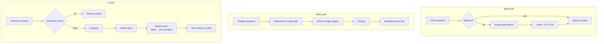

- **Shard by `userId`.** Every hot query is already user-scoped (`Book.find({userId})`), so
  `userId` is a natural, low-skew shard key with no query-pattern rewrites needed.
- **Separate the export service.** PDF/DOCX rendering is CPU-bound and bursty — exactly the
  workload you don't want sharing an event loop with chat-speed CRUD. Split it out and scale
  it independently.
- **Semantic cache for AI.** Outline requests cluster hard around popular topics. Embed the
  `{topic, style, numChapters}` tuple, cache by nearest neighbour above a similarity
  threshold — a large share of free-tier generations become free.
- **Full-text search.** `/explore` will need Atlas Search once the catalogue passes a few
  thousand books; a regex scan over `title` won't hold.
- **Frontend splitting.** GSAP + the Markdown editor + the reader are all eagerly bundled.
  `React.lazy` the editor and reader routes — most sessions touch one, not both.

### Cost levers, cheapest first

1. Cache Google Books responses (free quota, high repeat rate).
2. Route `define` and `continue` to the cheapest Flash model; reserve larger models for
   chapter drafting.
3. Serve covers as CDN derivatives, not originals.
4. Cache TTS audio by `hash(text + voiceId)` — re-listening a chapter should cost nothing.

---

## 🗺 Roadmap

- [ ] Move `uploads/` to object storage — unblocks horizontal scaling and stops deploys eating covers
- [ ] Re-enable `cheerio` in `ingestController` and delete the regex fallbacks
- [ ] SSRF hardening on `/books/ingest-url`
- [ ] Split `chapters` into its own collection; per-chapter autosave endpoint
- [ ] Queue + stream AI generation instead of blocking the request
- [ ] Rate limiting on every AI route
- [ ] Pagination and projection on `GET /books`
- [ ] `httpOnly` cookie auth with refresh rotation
- [ ] Reconcile `.env.example` with the variables the code actually reads
- [ ] Real payment integration behind `tier: 'premium'`
- [ ] Test suite — there is none today

---

<div align="center">

**Forge a book out of an idea.**

[Report a bug](https://github.com/satyansh911/BookForge/issues) · [Request a feature](https://github.com/satyansh911/BookForge/issues)

</div>
